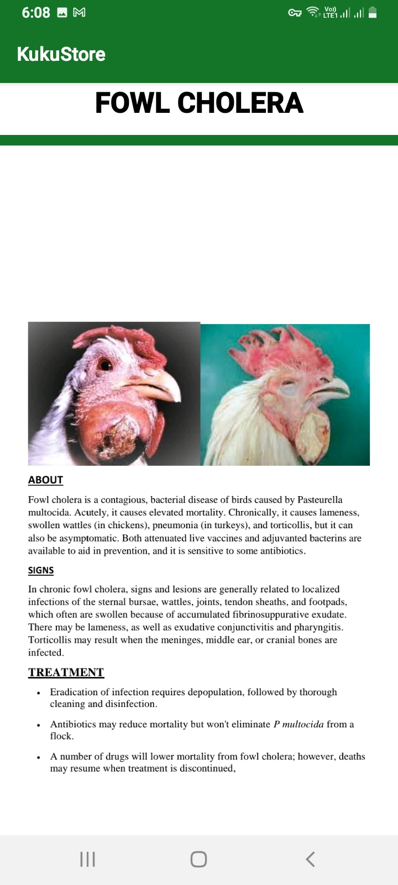

# KukuStore
 An Android app that displays information about chicken ranging from deseases, feeding, vaccination and housing. It is has employed the use of gridview layout, tab layouts and more .
#TECH STACK
### JAVA
### SQLITE
# SCREENSHOTs
 

 
 

